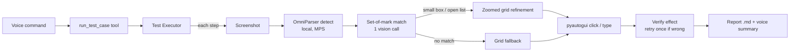
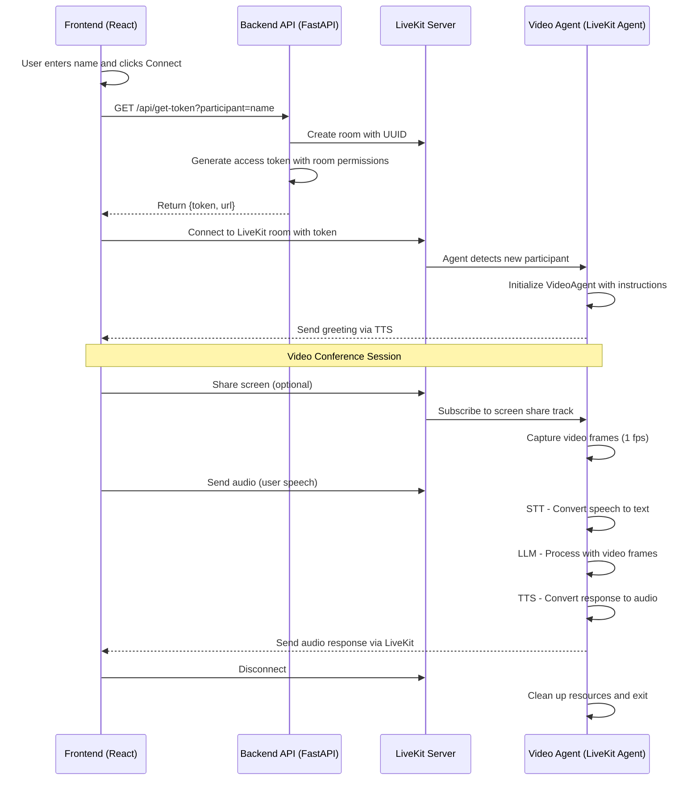

# AI Visual Testing over LiveKit

A voice-driven end-to-end testing agent built on LiveKit's real-time infrastructure. The user shares their screen, describes test cases in plain-English markdown files, and the agent executes them against the live application: it finds buttons, input fields, dropdowns, and list options visually — no DOM access, no selectors, no per-element template images — clicks and types with pyautogui, verifies outcomes, and reports results by voice and as a written report.

## Features

- **Voice-driven test execution**: say "run the test" and the agent runs the whole flow
- **Visual element location with OmniParser**: a locally-run detection model finds every interactable element with pixel-accurate bounding boxes; a vision LLM picks the right one by meaning ("Florida" matches a dropdown showing "FL")
- **Self-healing execution**: each typed value and selected option is verified on screen; misses fail honestly and are retried once (including re-opening a dropdown that closed)
- **Plain-markdown test cases**: numbered natural-language steps, no test framework required
- **Real-time Video & Audio**: built on LiveKit, with Deepgram STT/TTS and an LLM via the LiveKit inference gateway
- **Observability**: per-run markdown reports with failure screenshots, numbered locator debug images, and Langfuse tracing


## Architecture

The application consists of these components:

1. **Frontend (React)**: User interface built with LiveKit Components for video conferencing
2. **Backend API (FastAPI)**: REST API server for token generation and room management
3. **LiveKit Server**: Real-time infrastructure for video/audio streaming and room coordination
4. **Video Agent (`backend/video_agent.py`)**: the LiveKit agent — STT, LLM (function tools), TTS
5. **Element Locator (`backend/locator.py` + `backend/omni_locator.py`)**: OmniParser detection + set-of-mark matching, with iterative grid refinement as fallback
6. **Test Executor (`backend/executor.py`)**: runs parsed test steps, verifies effects, retries, writes reports
7. **Test Case Manager (`backend/testcases.py`)**: loads and parses markdown test cases

Test execution flow:





## Quick Start

### Prerequisites

- Python 3.13+ (the project uses `uv` with `backend/.venv`)
- Node.js 18+
- LiveKit Cloud project (provides the inference gateway used for all LLM/vision calls)
- API keys for: Deepgram, Langfuse (optional)
- macOS: grant the terminal **Screen Recording** and **Accessibility** permissions (the agent screenshots and clicks the local screen)

### Environment Setup

1. Clone the repository:
```bash
git clone <repository-url>
cd livekit-video
```

2. Set up environment variables:
```bash
# Create backend/.env
LIVEKIT_API_KEY=your_livekit_api_key      # also covers all LLM/vision calls
LIVEKIT_API_SECRET=your_livekit_api_secret
LIVEKIT_URL=wss://your-livekit-server.com

DEEPGRAM_API_KEY=your_deepgram_api_key
LANGFUSE_PUBLIC_KEY=your_langfuse_public_key   # optional
LANGFUSE_SECRET_KEY=your_langfuse_secret_key   # optional
LANGFUSE_HOST=your_langfuse_host               # optional

# LOCATOR_BACKEND=grid   # force the grid locator (skip OmniParser)
# LOCATOR_DEBUG=1        # save annotated locator images to backend/debug/
```

### Backend Setup

1. Navigate to the backend directory:
```bash
cd backend
```

2. Install dependencies (uv manages `.venv`):
```bash
uv venv && uv pip install -r requirements.txt
# optional but recommended — the OmniParser locator (~3 GB: torch, ultralytics):
uv pip install -r requirements-omni.txt
```

3. Start the FastAPI server:
```bash
uv run python api.py
```

4. In a separate terminal, start the LiveKit agent:
```bash
uv run python video_agent.py dev
```

Without the OmniParser dependencies the agent still works, using the slower
grid-only locator.

### Frontend Setup

1. Navigate to the frontend directory:
```bash
cd frontend
```

2. Install dependencies:
```bash
npm install
```

3. Start the development server:
```bash
npm run dev
```

4. Open your browser to `http://localhost:3000`

## Usage

### Basic Setup
1. **Join a Room**: Enter your name and click "Connect"
2. **Enable Screen Share**: Share your screen for the agent to see
3. **Start Talking**: The agent will respond using voice and can reference what it sees

## End-to-End Test Execution

The agent runs UI test cases defined in markdown files against the live
screen. Elements are located purely visually — no DOM access, no selectors,
no per-element template images.

### Element location

Every lookup goes through a cascade, from cheapest to most thorough:

1. **OmniParser detection + set-of-mark matching** (primary): the OmniParser
   v2 icon detector runs locally and boxes every interactable element with
   pixel accuracy; the screenshot is annotated with numbered boxes and one
   vision call picks the matching number. The model must cite the visible
   text as evidence for its pick.
2. **Zoomed refinement**: when the matched box spans multiple rows (an open
   dropdown detected as one element), is only a small anchor near the target
   (open-list rows often get no boxes at all), or contains an unboxed target
   (bare input fields shown as just `$` and an underline), the region is
   cropped, upscaled, and overlaid with a fine grid — iterating until cells
   are smaller than a list row — to pinpoint the exact click point.
3. **Control anchoring**: option lookups that fail outright are retried by
   first locating the dropdown control itself ("the year dropdown", derived
   from the step text) and searching the region around it where the open
   list renders.
4. **Iterative grid refinement** (fallback): a coarse 10x10 grid over the
   full screenshot, zoomed repeatedly. Used when OmniParser is not installed,
   errors, or the cascade above is exhausted. Force it with
   `LOCATOR_BACKEND=grid`.

Matching is by meaning, not exact wording: "Florida" matches an option
showing "FL", "Excellent" matches "Excellent (740 and above)". Guards prevent
the opposite failure: a different item of the same kind is never accepted
("FL" is not Texas), and for quoted numeric literals the cited evidence must
contain the number verbatim — the model cannot return the "2026" row for a
nonexistent "1999".

### Self-healing execution

The executor does not trust clicks blindly:

- after every **type** step it verifies the text actually appears in the
  field (a mis-click on a nearby link would otherwise send text nowhere);
- after every **option** click it verifies the selection is displayed in the
  dropdown (a one-row miss like "Very good" instead of "Excellent" fails the
  step instead of silently passing);
- a failed option step triggers one retry that first re-clicks the previous
  target, re-opening a dropdown that closed prematurely;
- radio buttons and checkboxes are clicked at the control position (left edge
  of the detected row), not the row center.

A step that still fails is reported honestly with a failure screenshot, and
the remaining steps are skipped.

### Why OmniParser

Compared to the original grid-only locator:

- **Pixel-accurate clicks** from real element bounding boxes instead of grid
  cell centers (no quantization error on small targets like radio buttons);
- **Faster and cheaper**: detection is local (~0.2 s warm on Apple Silicon
  MPS) and most lookups need one vision call instead of 2–4 zoom passes —
  locates dropped from ~8–15 s to ~3–5 s;
- **Honest refusals**: the matcher sees every detected element, so its "not
  on screen" answer is reliable, where a blind grid pass tends to hallucinate
  a location for absent elements.


> Note: the agent process must run on the same machine whose screen is being
> tested — screenshots and clicks happen locally via pyautogui. On macOS, grant
> the terminal Screen Recording and Accessibility permissions.

### Writing test cases

Add a markdown file to `backend/testcases/`:

```markdown
# Calculator

1. Click the "New" radio button under financing type
2. Enter "20000.00" in the financing amount input field
3. Click the credit score dropdown
4. Click the "Excellent (740 and above)" option in the credit score dropdown list
5. Click the year dropdown
6. Click the "2027" option in the year dropdown list
7. Click the "Get estimate" button
8. Wait 3 seconds
9. Verify an estimated monthly payment amount is displayed
```

Supported step verbs: `Click/Select/Choose/Press`, `Type/Enter "<text>" [in <field>]`,
`Verify/Check <expectation>`, `Wait <n> seconds`. Quoting the exact visible
text (as shown on screen) gives the matcher the strongest signal.

### Running tests

Say "run the new car calculator test" during a session. The agent finds the
matching test case (fuzzy name matching tolerates voice phrasing), executes
each step (screenshot → locate → act → verify), and reports the results by
voice. A full report is written to
`backend/results/<testcase>-<timestamp>.md`, with screenshots saved for any
failed steps.

Agent tools: `list_test_cases`, `run_test_case`, `click_element`, `type_text`,
`verify_screen`.

Set `LOCATOR_DEBUG=1` to save numbered annotated images for every locate in a
run (`backend/debug/locateNNN_som.png`, `locateNNN_refine.png`, ...) — the
fastest way to see exactly what the detector and the matcher saw when a step
misbehaves.

## Key Components

### Video Agent (`backend/video_agent.py`)

The core AI agent that handles:
- Voice conversation: Deepgram STT/TTS, Silero VAD, turn detection
- LLM via the LiveKit inference gateway (`openai/gpt-5.1`) with function tools
  for test execution: `list_test_cases`, `run_test_case`, `click_element`,
  `type_text`, `verify_screen`
- Screen-share frame capture at 1 fps (first/middle/most recent frames are
  added to the conversation for visual context)
- Langfuse observability tracking

### Element Locator (`backend/locator.py`, `backend/omni_locator.py`)

Turns a natural-language description ("the state dropdown", "the FL option in
the state dropdown list") into logical screen coordinates:

- **OmniParser v2 icon detector** (`microsoft/OmniParser-v2.0`, runs locally
  on Apple Silicon MPS via ultralytics/torch) produces pixel-accurate boxes
  for every interactable element
- **Set-of-mark matching**: one vision call through the LiveKit gateway picks
  the numbered box, citing visible-text evidence
- **Zoomed grid refinement** pinpoints targets inside multi-row boxes, around
  anchor boxes, and in unboxed areas (open dropdown lists, bare input fields)
- **Grid-only fallback** when the OmniParser dependencies are absent
- Retina-aware: all coordinates are converted from screenshot pixels to
  logical points for pyautogui automatically

### Test Executor (`backend/executor.py`)

- Runs parsed steps: click / type / verify / wait
- Verifies effects after type and option-selection steps; retries a failed
  option step once after re-opening its dropdown
- Writes `backend/results/<testcase>-<timestamp>.md` with per-step status and
  failure screenshots

### Test Case Manager (`backend/testcases.py`)

- Loads markdown test cases from `backend/testcases/` (hot-reloaded per run)
- Parses numbered natural-language steps into actions
- Fuzzy name matching so voice phrasing finds the right case

### API Server (`backend/api.py`)

FastAPI server providing:
- Token generation for LiveKit rooms
- Room creation and management
- CORS configuration for frontend access

### Knowledge Manager (`backend/knowledge_manager.py`)

Manages domain-specific knowledge:
- Loads markdown files from the knowledge directory
- Formats content for AI context
- Supports multiple knowledge domains (application)

### Frontend (`frontend/src/App.tsx`)

React application featuring:
- LiveKit room connection
- Video conference interface
- Token-based authentication
- Real-time video and audio

## Knowledge Base

The application includes a knowledge base system for domain-specific assistance:


## Customization

### Swapping AI Components

The agent uses LiveKit's plugin system, making it easy to swap components:

```python
# Change STT provider
from livekit.plugins import assemblyai
stt=assemblyai.STT()

# Change LLM provider
from livekit.plugins import anthropic
llm=anthropic.LLM(model="claude-3-sonnet")

# Change TTS provider
from livekit.plugins import elevenlabs
tts=elevenlabs.TTS(voice="your-voice-id")
```

### Adding Knowledge Domains

1. Create a new markdown file in `backend/knowledge/`
2. Update the `knowledge_files` mapping in `KnowledgeManager`
3. The agent will automatically include the new knowledge in its context

### Modifying Agent Behavior

Update the `INSTRUCTIONS` constant in `video_agent.py` to change the agent's personality, capabilities, or domain focus.

## Observability

The application integrates with Langfuse for comprehensive observability:

- **Traces**: Complete conversation flows with timing
- **Spans**: Individual component performance (STT, LLM, TTS)
- **Generations**: LLM inputs/outputs with cost tracking
- **Error Tracking**: Detailed error logging and debugging

Access your Langfuse dashboard to monitor agent performance and optimize responses.

## Production Considerations

- **Environment Variables**: Secure API key management
- **Error Handling**: Comprehensive error recovery
- **Rate Limiting**: API quota management
- **Scaling**: LiveKit server cluster configuration
- **Security**: CORS configuration, token validation
- **Monitoring**: Langfuse integration for production insights

## API Dependencies

This project requires API keys from:

- **LiveKit**: real-time infrastructure **and** the inference gateway — all
  LLM and vision calls (conversation, element matching, verification) are
  billed through LiveKit; no separate OpenAI key is needed
- **Deepgram**: speech-to-text and text-to-speech
- **Langfuse**: observability (optional)

Local models (no API): OmniParser v2 icon detection via torch/ultralytics.

All services offer free tiers for development and testing.

## Business Applications

This technology enables various use cases:

- **Automated E2E Testing**: voice-driven visual regression and smoke tests on any application — including ones with no test hooks, canvas UIs, or third-party sites
- **Technical Support**: Visual troubleshooting with screen sharing
- **Customer Onboarding**: Interactive product walkthroughs
- **Remote Assistance**: Equipment setup and configuration
- **Training & Education**: Interactive software tutorials
- **Professional Services**: Real-time consulting with visual context

## License

[Add your license information here]

## Contributing

[Add contribution guidelines here]

## Support

For questions about this implementation, please [open an issue](link-to-issues).
For LiveKit-specific questions, visit the [LiveKit documentation](https://docs.livekit.io/).